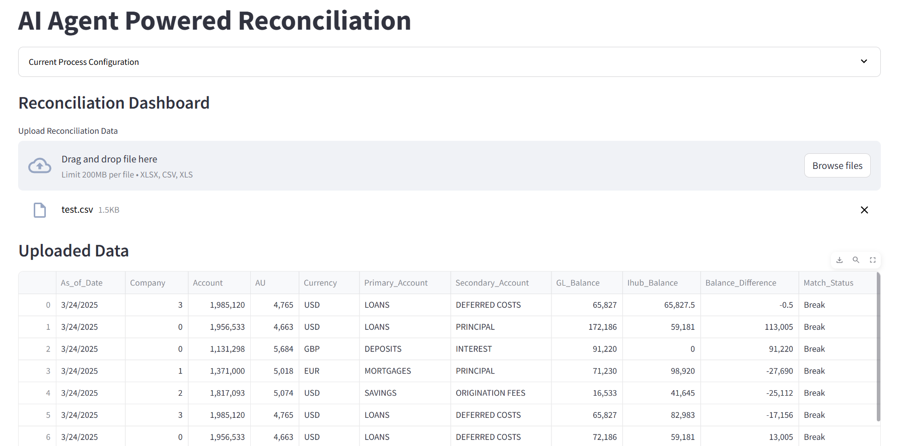

# 🚀 ReconcileX - AI Agent powered Reconciliation System

## 📌 Table of Contents
- [Introduction](#introduction)
- [Demo](#demo)
- [Inspiration](#inspiration)
- [What It Does](#what-it-does)
- [How We Built It](#how-we-built-it)
- [Challenges We Faced](#challenges-we-faced)
- [How to Run](#how-to-run)
- [Tech Stack](#tech-stack)
- [Team](#team)

---

## 🎯 Introduction
- Traditional reconciliation processes in fintech industry struggle with manual break resolution, data inconsistencies, and high operational costs.
- This AI agent powered system solves that problem by using AI-powered anomaly detection and break resolution to make reconciliation faster, smarter, and fully automated. Instead of spending hours digging through spreadsheets, teams can identify issues and get AI-powered fix suggestions in real-time.

## 🎥 Demo
🔗 [Live Demo](#) (if applicable)  
📹 [Video Demo](#) (if applicable)  
🖼️ Screenshots:



## 💡 Inspiration
The traditional reconciliation process in FinTech industry have the following painpoints for reconcilers and hinders the business from operating efficiently:  
🔶 80% of time is spent on break analysis instead of actual business decisions.  
🔶 Data mismatches are constant in reconciliation process, but finding the root cause is tedious.  
🔶 Too many manual task are required to complete the reconciliation which slows everything down.  

To resolve the above mentioned painpoints and to improve efficiency, the industry needs a smart reconciliation tool—one that detects anomalies, suggests fixes, and reduces human intervention. That's exactly what this system does.

## ⚙️ What It Does
✅ **Automates Break Resolution** - Uses LLMs (Llama/Mistral) to suggest fixes for reconciliation breaks.  
✅ **Real-Time Anomaly Detection** - Combines Autoencoder, LSTM, and Isolation Forest to flag transactions along with precise summaries of the anomaly using LLM.  
✅ **Human-in-the-Loop Review** - Operators can approve/reject AI-generated resolutions with feedback loops to improve accuray.  
✅ **Simulates External Systems** - Mocks responses from JIRA, mail, and trade systems for end-to-end automation testing.  
✅ **Interactive UI** - A dashboard for reconcilers to review anomalies, understand root causes, and apply fixes effortlessly and autonomously.

## 🛠️ How We Built It
🚀 Frontend (User Interface):
- Streamlit & Gradio – A smooth, interactive UI where users can upload data, review breaks, and apply fixes.

⚡ Backend (Processing Engine):
- FastAPI – A fast and scalable API for handling anomaly detection requests and fix approvals.
- LangChain + Llama/Mistral – An AI model that understands context and suggests meaningful fixes.

🧠 AI Models for Anomaly Detection:
- Pre-trained Autoencoder & LSTM – Detect unusual patterns and inconsistencies.
- Isolation Forest – Flags outliers and potential fraud risks in reconciliation data.
- LLM Summarization - Provides precise summaries of about the anomaly and the root cause.

🔗 Data Processing & Cleansing:
- OpenRefine – Cleans and formats key columns for better anomaly detection.

## 🚧 Challenges We Faced
- Solving this problem posed a couple of challenges which motivated us to learn more about the business impact of the process and gaps present in traditional reconciliation process.  
- Technical Challenges faced during implementation as follows:  
   - Diverse data format: Each reconciliation process have different data format which makes it difficult for a generalized AI solution
   - External System Simulations: Creating scalable solution with mock APIs to simulate the interactions with external system

## 🏃 How to Run
1. Clone the repository  
   ```sh
   git clone https://github.com/ewfx/sradg-hack-gpt
   cd sradg-hack-gpt
   ```
2. Install dependencies  
   ```sh
   python -m venv venv
   source venv/bin/activate  # On Windows: venv\Scripts\activate
   pip install -r requirements.txt
   ```
3. Run the Backend  
   ```sh
   cd code/src/
   uvicorn backend.main:app
   ```

4. Start the UI
   ```sh
   streamlit run code/src/ui/app.py
   ```

## 🏗️ Tech Stack
- 🔹 Frontend: Streamlit, Gradio
- 🔹 Backend: FastAPI, LangChain
- 🔹 LLM: Llama, HuggingFace models
- 🔹 Frameworks: AutoML, LangChain
- 🔹 Data Processing: OpenRefine
<!-- - 🔹 Database: PostgreSQL / Firebase -->

## 👥 Team HackGPT
- **Praveen Kumar R** - [GitHub](https://github.com/praveen-221) | [Website](https://praveenkr.vercel.app/)
- **Kirthi Vignesh G** - [GitHub](#) | [LinkedIn](#)
- **Shubham M Prabhu** - [GitHub](#) | [LinkedIn](#)
- **Mohammed Zaid Ali Syed** - [GitHub](#) | [LinkedIn](#)